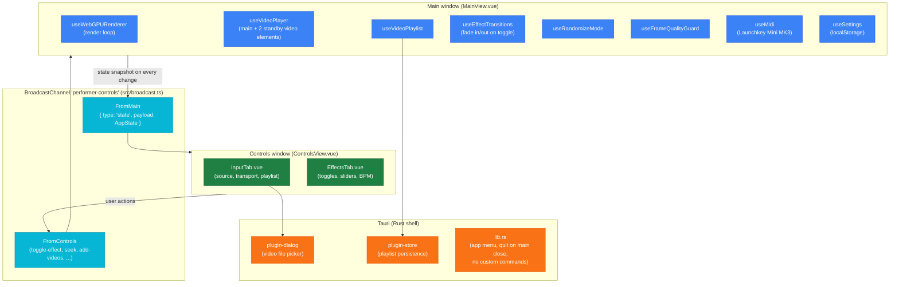
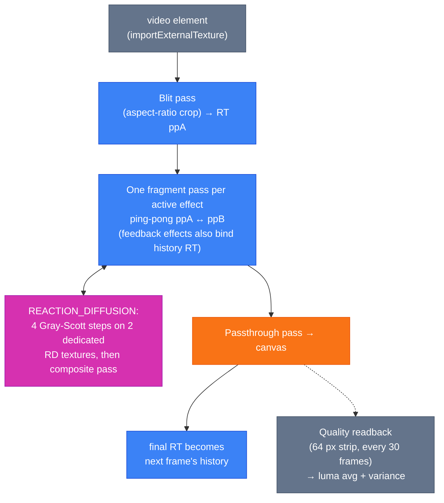

# Architecture

## Overall structure

Performer is a Tauri app with two webview windows running the same Vue app (`src/main.ts` mounts `src/App.vue` in both). `App.vue` checks `window.location.hash === '#controls'` and renders either `MainView` (canvas output) or `ControlsView` (control panel). Right-clicking the canvas opens the controls window via `WebviewWindow`.

All state lives in the main window. The controls window is stateless: it renders the latest state snapshot it received and sends action messages back.

### Cross-window protocol

`MainView` broadcasts the full `AppState` through a `watchEffect` whenever anything in it changes, and replies to `request-state` when the controls window opens. `ControlsView` sends one `FromControls` action message per user interaction; the main window applies it and the resulting state change broadcasts back automatically. Both message types are defined in `src/broadcast.ts`.

Vue reactive proxies cannot be structured-cloned, so everything posted on the channel is spread or `toRaw()`ed first (see `appState` in `MainView.vue`).

## Render pipeline (WebGPU)

`useWebGPURenderer.ts` owns the render loop. Each frame the video element is imported as an external texture, blitted with aspect-ratio crop, run through the active effect chain, and presented.

Three render targets rotate each frame: one holds the previous frame's final output (the history texture for feedback effects), the other two ping-pong for the current frame's effect chain. After present, the RT that received the final output becomes next frame's history. This avoids any per-frame texture copies; all bind group combinations are precomputed on resize.

If WebGPU is unavailable the renderer calls `onRendererUnavailable` and `MainView` shows an overlay instead of a black canvas.

### Frame quality guard

Every 30 frames a 64 pixel strip from the center of the final render target is read back to the CPU. While randomize mode is active, `useFrameQualityGuard` checks the luma average and variance; if the frame looks blown out or uniformly flat, it steps the loudest active effect's intensity down by 0.1. The change is made to the real intensity state, with no hidden override layer.

## Shader effect system

Effects are `ShaderEffect` enum entries with a `ShaderEffectDef` in `src/utils.ts`:

| stage      | meaning                                                                               |
| ---------- | ------------------------------------------------------------------------------------- |
| `mapping`  | mutates UV coordinates before sampling                                                |
| `color`    | mutates color after sampling                                                          |
| `feedback` | additionally reads `u_history` (previous frame's final output)                        |
| `compute`  | custom multi-pass pipeline (only `REACTION_DIFFUSION`, special-cased in the renderer) |

The WGSL snippets live in `effectWGSL` in `src/shaderBuilderWGSL.ts` and are inserted into a stage-specific fragment shader template by `createEffectShaderWGSL`. One pipeline per effect is built once at init.

The uniform buffer layout is derived at module load from `shaderEffects`: slots 0 to 5 are fixed (`time`, `bpm`, four crop values), then one `intensity_<EFFECT>` slot per effect that declares `intensity`, then one `bpmSync_<EFFECT>` slot per effect that declares `bpmSync`. Adding or removing either property automatically updates the float count, the indices (`UNIFORM_IDX`), and the WGSL `Uniforms` struct.

To add an effect: add the enum entry and `shaderEffects` record in `src/utils.ts`, then add its WGSL snippet to `effectWGSL` in `src/shaderBuilderWGSL.ts`. The renderer, uniform layout, controls UI (toggle, slider if it has `intensity`, BPM button if it has `bpmSync`), and randomize mode pick it up automatically (randomize also needs a weight in `EFFECT_WEIGHTS` in `useRandomizeMode.ts`).

BPM sync convention: ambient animation is always on; the beat-driven pulse is added on top and scales with intensity.

### Effect transitions

`useEffectTransitions` keeps two layers of state: what the user set (`activeEffects`, `effectIntensities`) and what the renderer sees (`renderingEffects`, `renderingIntensities`). Toggling an effect with an intensity uniform fades it in or out over 100 ms (`src/transitions.ts`); effects without one switch hard. Toggles are debounced at 50 ms to survive MIDI pad chatter.

## Video playback and randomize mode

`useVideoPlayer` drives a hidden main `<video>` element plus two standby elements used by randomize mode. `rendererVideoRef` points at whichever element the renderer should sample.

Randomize mode (`useRandomizeMode`) switches the scene every 16 or 32 beats at the current BPM:

1. When a switch is scheduled, the next snapshot (video index, seek position, effect set, intensities) is built immediately and the upcoming video is preloaded into the idle standby element, seeked to the exact target position so the browser buffers the right segment.
2. When the timer fires, the standby element starts playing, `rendererVideoRef` swaps to it, and the effect set is applied through the normal transition layer.
3. Effect sets are weighted per effect (about 4 to 5 active on average, with the noisiest kept rare); intensities are randomized in the 0.3 to 1.0 range. The current video is kept 20% of the time, otherwise a different playlist entry is picked.
4. If the timer fires more than 1.5 beats late (fullscreen transition, app suspend), scheduling re-anchors from now instead of cascading catch-up switches.

## MIDI

`useMidi` connects to a Novation Launchkey Mini MK3 (the only supported device). Ports are watched continuously, so plugging the controller in or reconnecting it mid-session works; on disconnect the state resets and reconnection re-triggers the sync notification.

Pads toggle effects; knobs set intensity for the top-row effects:

| Pad note | Effect         | Knob CC | Pad note | Effect          | Knob CC |
| -------- | -------------- | ------- | -------- | --------------- | ------- |
| 40       | INVERT         |         | 36       | GRAYSCALE       |         |
| 41       | REALITY_GLITCH | 21      | 37       | KALEIDOSCOPE    |         |
| 42       | DISPLACE       | 23      | 38       | SWIRL           |         |
| 43       | CHROMA         | 24      | 39       | PALETTE_CYCLING |         |
| 48       | PIXELATE       | 25      | 44       | CONTOUR         |         |
| 49       | VORONOI        | 26      |          |                 |         |
| 50       | RIPPLE         | 27      |          |                 |         |
| 51       | FEEDBACK_ECHO  | 28      |          |                 |         |

Knob values snap to 0 below 3 and to 1 above 124 so the physical end stops reliably hit the extremes. While MIDI is connected, the on-screen sliders for knob-controlled effects are disabled.

## Persistence

| What                                | Where                                                     |
| ----------------------------------- | --------------------------------------------------------- |
| showHelp, isMuted, inputSource, bpm | `localStorage` (`useSettings.ts`)                         |
| playlist (user file paths)          | Tauri store `performer.json` (`useVideoPlaylist.ts`)      |
| active effects, intensities         | never persisted; every launch starts with all effects off |

## Conventions

- Domain composables live next to the component that owns them (`src/components/input/useVideoPlayer.ts`); shared infrastructure composables live in `src/composables/`. No barrel `index.ts` files; import directly from the file path.
- There is no Pinia or Vuex store. State flows through composable refs in the main window and crosses windows only via BroadcastChannel.
