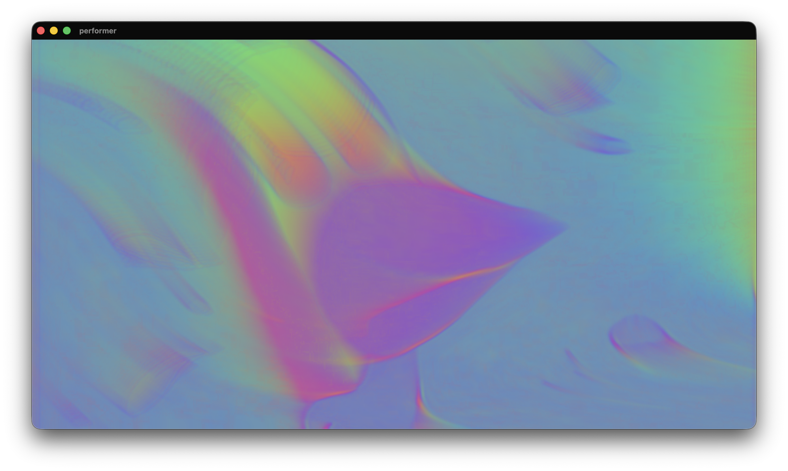

# Performer

Perform with live video or VODs and apply effects to them.



Right-click the canvas to open the controls in a separate tab. Use a webcam or load your own video files.

It supports connecting a Launchkey Mini MK3 to control effects and intensity via MIDI.
Currently that's the only device supported (because that's the one I own). PRs with other devices welcome.

## Download

Get the latest release for macOS or Windows from the [Releases](https://github.com/berrutti/performer/releases) page.

### macOS note

The app is not code-signed, so macOS will block it on first launch. To fix this, after you drag and dropped the app to `Applications`, run once in Terminal:

```bash
xattr -cr /Applications/Beatmatcher.app
```

Then the app should open without problems.

---

## Getting started

Import videos into the playlist or use a webcam. Apply effects to generate interesting combinations.

## Development

```bash
yarn install
yarn dev
```

Built with Tauri + Vue 3 + TypeScript + Vite.

## License

Performer - A desktop app to perform with live video or VODs and effects.  
Copyright (C) 2026 Matias Berrutti

This program is free software: you can redistribute it and/or modify it under the terms of the GNU General Public License as published by the Free Software Foundation, either version 3 of the License, or (at your option) any later version.

See the [LICENSE](LICENSE) file for the full terms.
